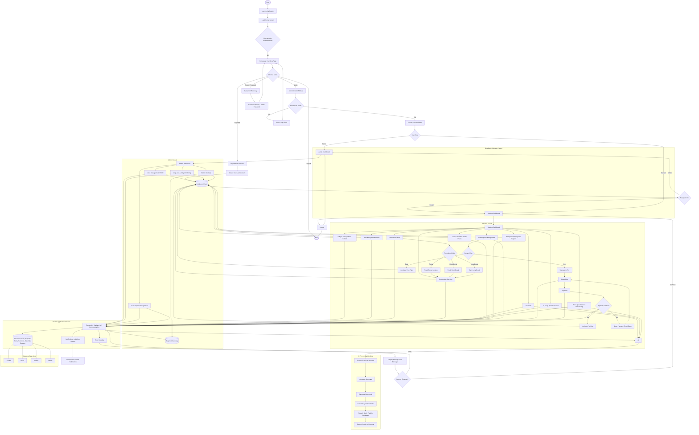

# FocusFlow System Flowchart

## Flow Overview

- The system starts at the application launch and routes the user to the homepage.
- Authentication handles login, registration, password recovery, and logout.
- Role-based access directs users to the Admin or Student workflow.
- Admins manage users, logs, subscriptions, and system settings.
- Students use the Pomodoro timer, productivity tracking, AI coaching, study packs, and subscription features.
- All modules communicate through the backend API, database, AI engine, payment gateway, and notification services.
- Errors are handled centrally and users are guided back to retry or continue safely.

